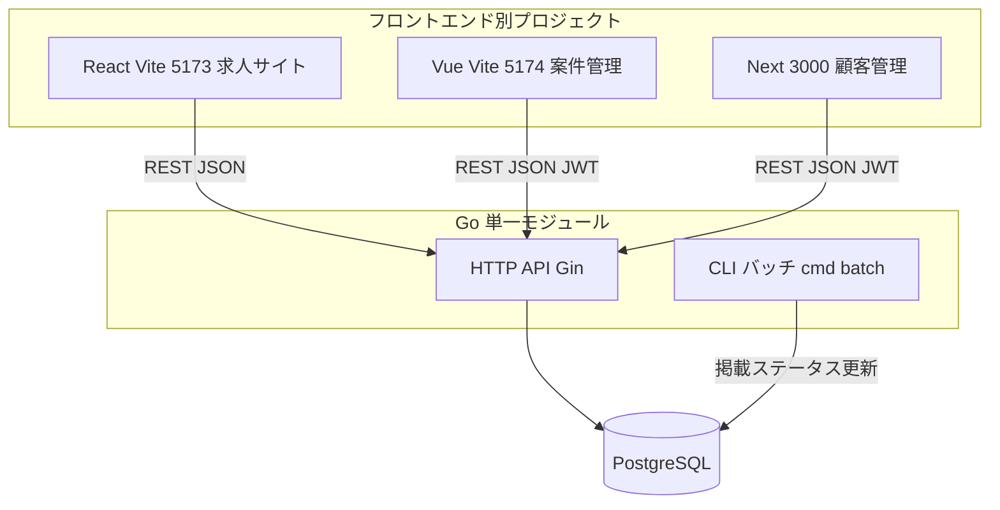
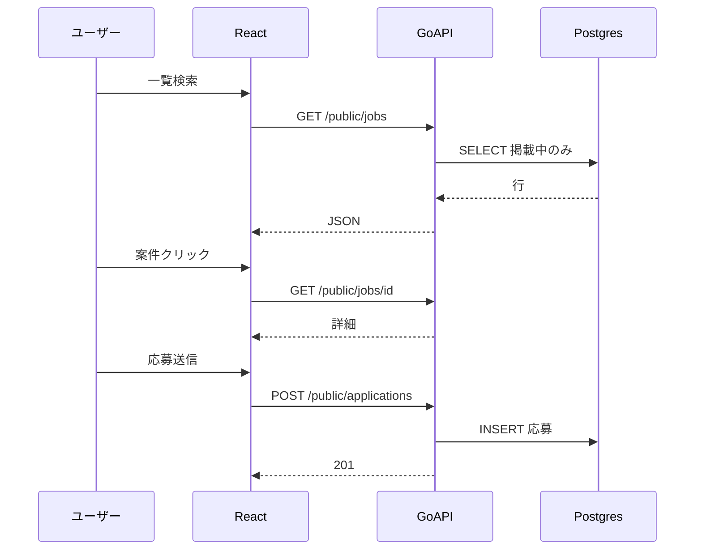
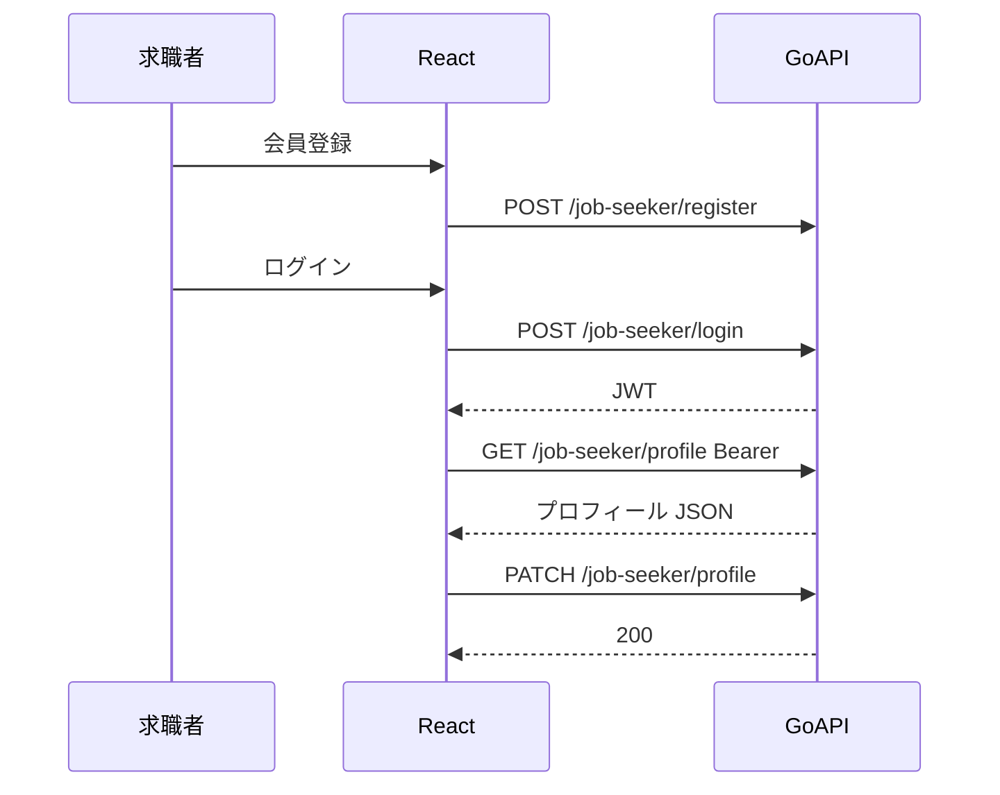
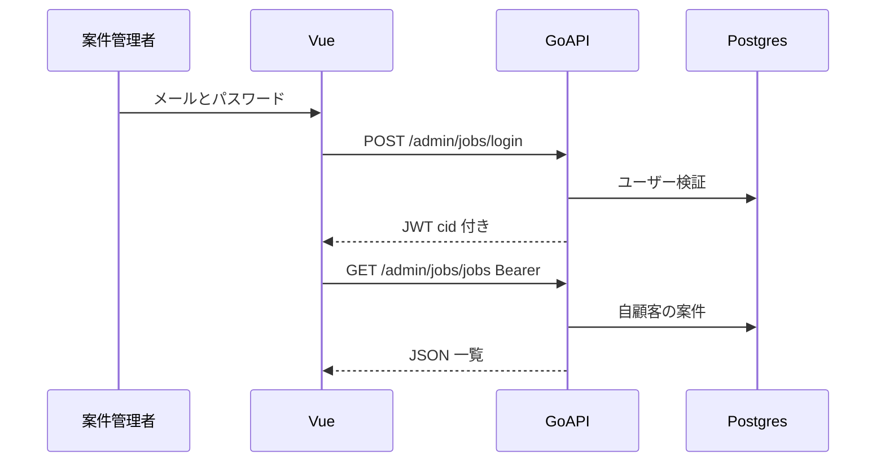
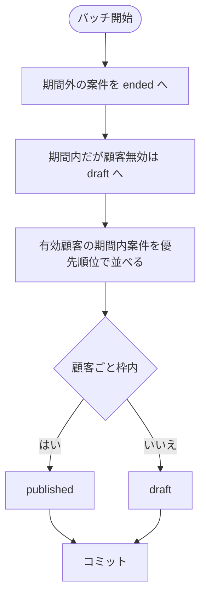
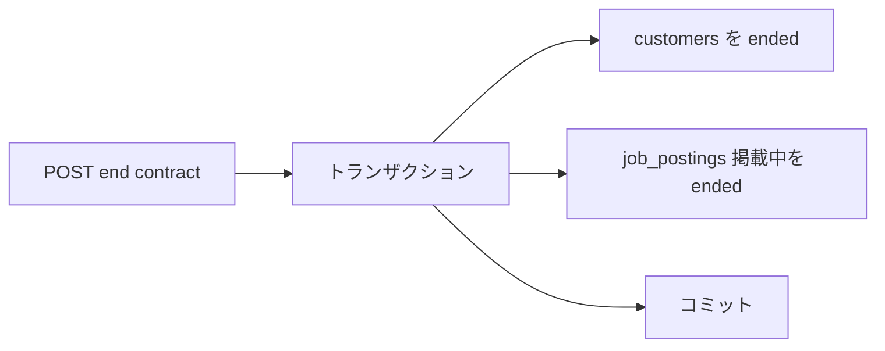

# 求人広告サイト群 システム資料

この資料は、システム全体の把握に必要な情報（構成図・主要フロー・HTTP API）をまとめたものです。  
画面一覧とスクリーンショット運用は [画面一覧.md](画面一覧.md) / [screenshots/README.md](screenshots/README.md) を参照してください。

## この資料の読み方

1. **全体像を把握**: 「各システムの概要」と「1. システム概要図」
2. **主要処理を確認**: 「2. フロー図」
3. **実装参照用に確認**: 「3. HTTP API 一覧」「4. 関連ファイル」
4. **拡張要素を確認**: 「5. 追加機能（設計メモ）」

---

## 各システムの概要と技術スタック

要件（`test`）どおり、フロントは用途ごとに **別プロジェクト**、バックエンドとバッチは **同一 Go モジュール**（`recruitment`）に集約しています。

### 求人サイト（公開）— `frontend-react`

| 項目 | 内容 |
|------|------|
| 概要 | 求職者向け。トップ兼一覧、案件詳細モーダル、応募モーダルを提供。**会員登録・ログイン・マイページ（プロフィール編集）**は JWT（`job_seeker`）で `/job-seeker/*` を利用。 |
| 言語 | **TypeScript**（`.tsx`） |
| UI | **React 18** |
| ビルド／開発 | **Vite 5** |
| 既定ポート | `5173` |
| バックエンド通信 | `fetch` → REST JSON（`GET /public/jobs` 等）。API のオリジンは `VITE_API_ORIGIN`（未設定時は `http://localhost:8080`）。 |

### 案件管理サイト — `frontend-vue`

| 項目 | 内容 |
|------|------|
| 概要 | 広告主（顧客）側オペレータ向け。ログイン、案件の一覧・検索・作成 / 更新 / 削除モーダル、応募者一覧を提供。対象は自顧客案件のみ。 |
| 言語 | **TypeScript**（`.vue` 内 `<script setup lang="ts">`） |
| UI | **Vue 3**（Composition API） |
| ビルド／開発 | **Vite 5** |
| 既定ポート | `5174` |
| バックエンド通信 | ログイン後 **JWT** を `Authorization: Bearer` で付与し、`/admin/jobs/*` を呼び出す。`VITE_API_ORIGIN` で API URL を変更可。 |

### 顧客管理サイト — `frontend-next`

| 項目 | 内容 |
|------|------|
| 概要 | 社内向け。顧客・契約レベル・契約終了、案件管理ユーザーの発行、請求書、見込み顧客（営業向け）など。 |
| 言語 | **TypeScript**（`.tsx`） |
| UI | **React 18** |
| フレームワーク | **Next.js 14**（App Router）。画面は `"use client"` を中心としたクライアントコンポーネントで構成。 |
| 既定ポート | `3000` |
| バックエンド通信 | ログイン後 JWT を `localStorage` に保持し `fetch` で `/admin/customers/*`。`NEXT_PUBLIC_API_ORIGIN` で API URL を変更可。 |

### HTTP API（バックエンド）— Go 単一モジュール

| 項目 | 内容 |
|------|------|
| 概要 | 三フロント共通の **REST（JSON）**。`/public`（匿名）、`/job-seeker`（求職者 JWT）、`/admin/jobs`（案件管理 JWT）、`/admin/customers`（顧客管理 JWT）を提供。起動時に **SQL マイグレーション** を実行。 |
| 言語 | **Go** 1.22 想定 |
| 主要ライブラリ | **Gin**（HTTP ルータ）、**gin-contrib/cors**、**jackc/pgx**（PostgreSQL）、**golang-jwt**、**x/crypto/bcrypt** |
| エントリ | `cmd/api` |
| 既定ポート | `8080`（環境変数 `API_ADDR`） |

### 掲載バッチ — Go

| 項目 | 内容 |
|------|------|
| 概要 | 基準日の掲載期間・顧客契約の有効性・契約 tier に応じた件数上限から `job_postings.publication_status` を `published` / `draft` / `ended` に更新。 |
| 言語 | **Go**（API と同一 `go.mod`・依存関係） |
| エントリ | `cmd/batch` |
| 実行 | CLI。`docker compose --profile tools run --rm batch` または `go run ./cmd/batch`。タイムゾーンは **Asia/Tokyo**（`BATCH_DATE` で基準日を上書き可）。 |

### データベース

| 項目 | 内容 |
|------|------|
| 製品 | **PostgreSQL** 16（Docker Compose のイメージ想定） |
| 言語 | **SQL**（スキーマは `internal/migrate/sql/*.sql` に埋め込み、`schema_migrations` で適用済み管理） |
| 役割 | 顧客・案件・応募・管理者ユーザー・請求・見込み顧客などの永続化。 |

接続ホスト・ポート・ユーザー情報は **[データベース接続.md](データベース接続.md)**（A5:SQL Mk-2 手順付き）を参照してください。

### 開発・実行まわり

| 項目 | 内容 |
|------|------|
| コンテナ | **Docker** / **Docker Compose**（ルート `Dockerfile` で API・バッチ用バイナリをビルド） |
| 補助 | **Makefile**、**Bash**（`scripts/*.sh`）。Go 未導入環境向けに **bootstrap スクリプト**（`.tools/go` への展開）あり。 |
| 仕様・手順書 | **Markdown**（本ファイル、`README.md`、`実装計画書.md`、要件メモ `test`） |

---

## 1. システム概要図

### 役割対応表

| コンポーネント | 役割 |
| -------------- | ---- |
| React | 公開求人の閲覧・検索・応募、求職者ログイン・プロフィール（JWT） |
| Vue | 広告主側の案件 CRUD・応募者確認（案件管理 JWT） |
| Next | 社内の顧客・契約・請求・案件管理ユーザー・見込み、**顧客／管理者の承認**、**顧客イベント履歴**（顧客管理 JWT） |
| Go API | ルートグループ `/public` `/admin/jobs` `/admin/customers`、マイグレーション |
| Go バッチ | 掲載期間・契約枠に応じ `publication_status` を `published` / `draft` / `ended` に更新 |
| PostgreSQL | 永続化（顧客・案件・応募・ユーザー・請求・見込み） |

---

## 2. 主要フロー

### 2.1 求職者の応募フロー（React → API）

### 2.1b 求職者ログイン・マイページ（React → API）

### 2.2 案件管理：ログイン〜一覧（Vue → API）

### 2.3 掲載バッチ（契約枠と期間）

優先順位（実装）は、同一顧客内で `publish_start` 昇順 → `created_at` 昇順 → `id` 昇順です。  
契約 tier は `1=10件 / 2=100件 / 3=無制限` です。

### 2.4 顧客契約終了時（API トランザクション）

---

## 3. HTTP API 一覧

ベース URL 例は `http://localhost:8080` です。  
認証が必要なエンドポイントは `Authorization: Bearer <JWT>` ヘッダーを付与します。

表中の **ハンドラ列**は、実装ファイル [handlers.go](../internal/interfaces/http/handlers.go) の関数名です。  
ルート登録は [router.go](../internal/interfaces/http/router.go) のコメントを参照してください。

### 3.1 ヘルス

| API名 | メソッド | パス | 認証 | ハンドラ | 説明 |
| ----- | -------- | ---- | ---- | -------- | ---- |
| ヘルスチェック | GET | `/health` | 不要 | `health` | 生存確認 `{"status":"ok"}` |

### 3.2 公開（求職者向け・匿名）

| API名 | メソッド | パス | 認証 | ハンドラ | クエリ / ボディ | 成功時 |
| ----- | -------- | ---- | ---- | -------- | --------------- | ------ |
| 公開求人一覧取得 | GET | `/public/jobs` | 不要 | `listPublicJobs` | `q` 任意 | `200` `{"jobs":[...]}` |
| 公開求人詳細取得 | GET | `/public/jobs/{id}` | 不要 | `getPublicJob` | — | `200` / `404` |
| 公開お知らせ一覧取得 | GET | `/public/announcements` | 不要 | `listAnnouncementsPublic` | クエリ **`channel`** | `200` `{"announcements":[...]}` |
| 求人応募作成 | POST | `/public/applications` | 不要 | `createApplication` | JSON 下表 | `201` |

公開求人・応募は **`customers.approval_status = approved`** の顧客案件のみ対象です（未承認顧客は掲載されません）。

**POST `/public/applications` ボディ**

| フィールド | 型 | 必須 |
| ---------- | --- | ---- |
| `job_posting_id` | number | はい |
| `applicant_name` | string | はい |
| `career_summary` | string | はい |
| `contact` | string | はい |

`contact` に `@` を含む場合、応募保存と同一トランザクションで **サンキューメール** が `email_outbox` に `pending` で積まれます（送信には `cmd/mailworker` と SMTP 設定が必要）。

### 3.2b 求職者アカウント（`/job-seeker`）

| API名 | メソッド | パス | 認証 | ハンドラ | 説明 |
| ----- | -------- | ---- | ---- | -------- | ---- |
| 求職者アカウント登録 | POST | `/job-seeker/register` | 不要 | `jobSeekerRegister` | `{"email","password"}` → `201` `{"id"}` |
| 求職者ログイン | POST | `/job-seeker/login` | 不要 | `jobSeekerLogin` | 同上 → `200` `{"token"}`（JWT `role=job_seeker`） |
| 求職者プロフィール取得 | GET | `/job-seeker/profile` | `job_seeker` | `jobSeekerGetProfile` | プロフィール JSON |
| 求職者プロフィール更新 | PATCH | `/job-seeker/profile` | `job_seeker` | `jobSeekerUpdateProfile` | `display_name`, `phone`, `career_summary`, `notes` |

### 3.3 案件管理サイト用（`/admin/jobs`）

| API名 | メソッド | パス | 認証 | ハンドラ | 説明 |
| ----- | -------- | ---- | ---- | -------- | ---- |
| 案件管理ログイン | POST | `/admin/jobs/login` | 不要 | `jobAdminLogin` | `{"email","password"}` → `200` `{"token","customer_id"}` |
| 自社案件一覧取得 | GET | `/admin/jobs/jobs` | `job_admin` | `jobAdminListJobs` | `q` 任意。自顧客の全ステータス案件 |
| 自社案件作成 | POST | `/admin/jobs/jobs` | `job_admin` | `jobAdminCreateJob` | ボディ下表 → `201` `{"id"}` |
| 自社案件詳細取得 | GET | `/admin/jobs/jobs/{id}` | `job_admin` | `jobAdminGetJob` | 自顧客の案件 |
| 自社案件更新 | PATCH | `/admin/jobs/jobs/{id}` | `job_admin` | `jobAdminUpdateJob` | ボディは POST と同形 |
| 自社案件削除 | DELETE | `/admin/jobs/jobs/{id}` | `job_admin` | `jobAdminDeleteJob` | `204` |
| 自社案件応募一覧取得 | GET | `/admin/jobs/jobs/{id}/applications` | `job_admin` | `jobAdminListApplications` | 応募一覧 |
| 案件管理お知らせ一覧取得 | GET | `/admin/jobs/announcements` | `job_admin` | `listAnnouncementsJobAdminFeed` | お知らせ（`job_admin` + `all`、掲載期間内・有効のみ） |

**案件作成・更新ボディ**

| フィールド | 型 | 必須 | 備考 |
| ---------- | --- | ---- | ---- |
| `summary` | string | はい | 概要 |
| `requirements` | string | はい | 募集要望 |
| `publish_start` | string | はい | `YYYY-MM-DD` |
| `publish_end` | string | はい | `YYYY-MM-DD` |

### 3.4 顧客管理サイト用（`/admin/customers`）

| API名 | メソッド | パス | 認証 | ハンドラ | 説明 |
| ----- | -------- | ---- | ---- | -------- | ---- |
| 顧客管理ログイン | POST | `/admin/customers/login` | 不要 | `customerAdminLogin` | `{"email","password"}` → `{"token"}`。`registration_status` が `pending` / `rejected` のときは **403** |
| 顧客管理お知らせフィード取得 | GET | `/admin/customers/announcements/feed` | `customer_admin` | `announcementsFeedCustomer` | ログイン後トップ用お知らせ |
| 顧客管理お知らせ一覧取得 | GET | `/admin/customers/announcements` | `customer_admin` | `listAnnouncementsManage` | お知らせ一覧（管理・全件） |
| 顧客管理お知らせ作成 | POST | `/admin/customers/announcements` | `customer_admin` | `createAnnouncement` | お知らせ登録 |
| 顧客管理お知らせ詳細取得 | GET | `/admin/customers/announcements/{id}` | `customer_admin` | `getAnnouncement` | 詳細 |
| 顧客管理お知らせ更新 | PATCH | `/admin/customers/announcements/{id}` | `customer_admin` | `updateAnnouncement` | 更新 |
| 顧客管理お知らせ削除 | DELETE | `/admin/customers/announcements/{id}` | `customer_admin` | `deleteAnnouncement` | 削除 |
| 顧客管理管理者一覧取得 | GET | `/admin/customers/customer-admins` | `customer_admin` | `listCustomerAdmins` | 顧客管理ログインユーザ一覧 |
| 顧客管理管理者作成 | POST | `/admin/customers/customer-admins` | `customer_admin` | `createCustomerAdmin` | 新規は **`registration_status=pending`** |
| 顧客管理管理者更新 | PATCH | `/admin/customers/customer-admins/{adminUserId}` | `customer_admin` | `updateCustomerAdmin` | `email`, `active`, 任意 `password`, 任意 `registration_status` |
| 顧客管理管理者削除 | DELETE | `/admin/customers/customer-admins/{adminUserId}` | `customer_admin` | `deleteCustomerAdmin` | 削除（最後の1人は不可） |
| 顧客一覧取得 | GET | `/admin/customers/customers` | `customer_admin` | `customerList` | `q` 任意 |
| 顧客作成 | POST | `/admin/customers/customers` | `customer_admin` | `customerCreate` | 新規は **`approval_status=pending`** |
| 顧客イベント一覧取得 | GET | `/admin/customers/customers/{id}/events` | `customer_admin` | `listCustomerEvents` | 顧客イベント一覧（時系列） |
| 顧客イベント作成 | POST | `/admin/customers/customers/{id}/events` | `customer_admin` | `createCustomerEvent` | 打ち合わせ・利用開始・特記・リスク等 |
| 顧客イベント更新 | PATCH | `/admin/customers/customers/{id}/events/{eventId}` | `customer_admin` | `updateCustomerEvent` | イベント更新 |
| 顧客イベント削除 | DELETE | `/admin/customers/customers/{id}/events/{eventId}` | `customer_admin` | `deleteCustomerEvent` | イベント削除 |
| 顧客詳細取得 | GET | `/admin/customers/customers/{id}` | `customer_admin` | `customerGet` | 詳細 |
| 顧客更新 | PATCH | `/admin/customers/customers/{id}` | `customer_admin` | `customerUpdate` | 任意で `approval_status` 更新可 |
| 顧客契約終了 | POST | `/admin/customers/customers/{id}/end-contract` | `customer_admin` | `customerEndContract` | 契約終了＋掲載中案件を ended |
| 案件管理ユーザー一覧取得 | GET | `/admin/customers/customers/{id}/job-users` | `customer_admin` | `listJobUsers` | 案件管理ユーザー一覧 |
| 案件管理ユーザー作成 | POST | `/admin/customers/customers/{id}/job-users` | `customer_admin` | `createJobUser` | `{"email","password"}` |
| 案件管理ユーザー更新 | PATCH | `/admin/customers/job-users/{userId}` | `customer_admin` | `updateJobUser` | クエリ `customer_id` 必須 |
| 案件管理ユーザー削除 | DELETE | `/admin/customers/job-users/{userId}` | `customer_admin` | `deleteJobUser` | クエリ `customer_id` 必須 |
| 請求一覧取得 | GET | `/admin/customers/invoices` | `customer_admin` | `listInvoices` | 任意クエリ `customer_id` |
| 請求作成 | POST | `/admin/customers/invoices` | `customer_admin` | `createInvoice` | 請求作成 |
| 請求詳細取得 | GET | `/admin/customers/invoices/{id}` | `customer_admin` | `getInvoice` | 請求詳細 |
| 応募一覧取得（全顧客） | GET | `/admin/customers/applications` | `customer_admin` | `adminListApplications` | `q`, `limit` 任意 |
| メールキュー一覧取得 | GET | `/admin/customers/email-queue` | `customer_admin` | `listEmailQueue` | メールキュー |
| メールキュー作成 | POST | `/admin/customers/email-queue` | `customer_admin` | `enqueueManualEmail` | 手動キュー |
| メール再送待ち戻し | POST | `/admin/customers/email-queue/{id}/retry` | `customer_admin` | `retryEmailOutbox` | `failed` → `pending` |
| 見込み顧客一覧取得 | GET | `/admin/customers/prospects` | `customer_admin` | `listProspects` | `q` 任意 |
| 見込み顧客作成 | POST | `/admin/customers/prospects` | `customer_admin` | `createProspect` | 見込み作成 |
| 見込み顧客詳細取得 | GET | `/admin/customers/prospects/{id}` | `customer_admin` | `getProspect` | 見込み詳細 |
| 見込み顧客更新 | PATCH | `/admin/customers/prospects/{id}` | `customer_admin` | `updateProspect` | 見込み更新 |
| 見込み顧客削除 | DELETE | `/admin/customers/prospects/{id}` | `customer_admin` | `deleteProspect` | 見込み削除 |

**顧客イベント POST/PATCH ボディ**

| フィールド | 型 | 必須 | 備考 |
| ---------- | --- | ---- | ---- |
| `event_kind` | string | はい | `meeting` \| `contract_start` \| `risk_flag` \| `note` \| `other` |
| `occurred_at` | string | はい | RFC3339 等（例: `2026-04-14T15:00:00.000Z`） |
| `title` | string | はい | 件名 |
| `body` | string | いいえ | 本文 |
| `is_risk_related` | boolean | いいえ | デフォルト `false` |

**顧客作成・更新ボディ**

| フィールド | 型 | 必須 |
| ---------- | --- | ---- |
| `name` | string | はい |
| `description` | string | いいえ |
| `contract_tier` | number | はい（1=10件 / 2=100件 / 3=無制限） |
| `contract_start` | string | はい `YYYY-MM-DD` |
| `contract_end` | string | いいえ `YYYY-MM-DD` |
| `approval_status` | string | いいえ | **PATCH のみ**。`pending` / `approved` / `rejected` |

**請求 POST ボディ**

| フィールド | 型 | 必須 |
| ---------- | --- | ---- |
| `customer_id` | number | はい |
| `issued_at` | string | はい `YYYY-MM-DD` |
| `amount_cents` | number | はい（正の整数、円単位想定） |
| `status` | string | いいえ（既定 `draft` または `confirmed`） |
| `notes` | string | いいえ |

### 3.5 JWT クレーム（参考）

| ロール | `role` 値 | 備考 |
| ------ | ----------- | ---- |
| 案件管理 | `job_admin` | `cid` に顧客 ID |
| 顧客管理 | `customer_admin` | `cid` は 0。顧客スコープは API 側で全件許可 |
| 求職者 | `job_seeker` | `uid` が求職者アカウント ID。`cid` は 0 |

---

## 4. 関連ファイル

- ルート定義（Gin）: [internal/interfaces/http/router.go](../internal/interfaces/http/router.go)
- ハンドラ: [internal/interfaces/http/handlers.go](../internal/interfaces/http/handlers.go)
- DB アクセス（DDD infrastructure）: [internal/infrastructure/persistence/postgres/repository.go](../internal/infrastructure/persistence/postgres/repository.go)
- バッチ: [internal/batch/run.go](../internal/batch/run.go)

---

## 5. 追加機能（設計メモ）

以下は今回要望の追加機能を、**実装済み API** として整理した一覧です。  
DB は `008_additional_features.sql` と `009_seed_additional_features.sql` で追加・ダミーデータ投入済みです。

### 5.1 求人サイト（求職者向け）

| 機能 | 想定 API 名 | 想定パス例 |
| ---- | ----------- | ---------- |
| お気に入りキープ | 求人お気に入り一覧取得 / 求人お気に入り追加 / 求人お気に入り削除 | `GET/POST/DELETE /job-seeker/favorites` |
| 閲覧履歴 | 求人閲覧履歴一覧取得 / 求人閲覧履歴追加 | `GET/POST /job-seeker/history` |
| 企業詳細・口コミ・地図 | 企業詳細取得 / 企業口コミ一覧取得 | `GET /public/companies/{id}` `GET /public/companies/{id}/reviews` |
| YouTube 動画埋め込み | 企業紹介動画一覧取得 | `GET /public/companies/{id}/videos` |
| 職種別給与相場シミュレータ | 給与相場試算 | `POST /public/salary-simulations` |

### 5.2 案件管理サイト（企業側）

| 機能 | 想定 API 名 | 想定パス例 |
| ---- | ----------- | ---------- |
| 企業プロフィール | 自社プロフィール取得 / 自社プロフィール更新 | `GET/PATCH /admin/jobs/company-profile` |
| 職種 AI アシスト | 職種説明 AI 補助生成 | `POST /admin/jobs/ai/job-assist` |
| 求人媒体連携（Indeed 等） | 媒体連携一覧取得 / 媒体連携作成 / 媒体連携更新 | `GET/POST/PATCH /admin/jobs/media-connections` |
| ダッシュボード・分析・レポート | ダッシュボード集計取得 / レポート一覧取得 | `GET /admin/jobs/dashboard` `GET /admin/jobs/reports` |
| 流入分析 | 媒体別流入集計取得 | `GET /admin/jobs/analytics/inflow` |
| Web 面談連携 | 面談 URL 発行 / 面談予定一覧取得 | `POST /admin/jobs/interviews/links` `GET /admin/jobs/interviews` |
| スカウト | スカウト一覧取得 / スカウト作成 / スカウト更新 | `GET/POST/PATCH /admin/jobs/scouts` |
| YouTube 埋め込み登録 | 企業動画登録 / 企業動画削除 | `POST/DELETE /admin/jobs/company-videos` |
| 入社後フォローアップ | フォローアップ設定取得 / 更新（契約 tier 制御） | `GET/PATCH /admin/jobs/follow-up-policy` |
| 外国籍可否・言語指定 | 求人多言語条件更新 | `PATCH /admin/jobs/jobs/{id}/global-options` |
| 給与相場シミュレータ | 企業向け給与相場試算 | `POST /admin/jobs/salary-simulations` |

### 5.3 顧客管理サイト（社内）

| 機能 | 想定 API 名 | 想定パス例 |
| ---- | ----------- | ---------- |
| 契約レベル別フォローアップ可変 | 顧客フォローアップ利用可否判定取得 / 契約レベル反映更新 | `GET /admin/customers/customers/{id}/follow-up-capabilities` `PATCH /admin/customers/customers/{id}` |
