# 画面一覧（システム別）

各システムの画面を一覧化した台帳です。  
スクリーンショット命名・保存ルールの確認にも利用してください。

スクリーンショット本体は `docs/screenshots/` 配下に格納します。

## 1. 求人サイト（公開）`frontend-react`

| 画面ID | 画面名 | 主用途 | スクショファイル |
|---|---|---|---|
| PUB-01 | 求人一覧（トップ） | 公開求人の閲覧・検索 | [表示](screenshots/public-site/PUB-01_求人一覧.png) |
| PUB-02 | 求人詳細モーダル | 求人詳細の確認 | [表示](screenshots/public-site/PUB-02_求人詳細モーダル.png) |
| PUB-03 | 応募モーダル | 求人応募の入力・送信 | [表示](screenshots/public-site/PUB-03_応募モーダル.png) |
| PUB-04 | 求職者ログイン | 求職者アカウント認証 | [表示](screenshots/public-site/PUB-04_求職者ログイン.png) |
| PUB-05 | 求職者登録 | 新規アカウント作成 | [表示](screenshots/public-site/PUB-05_求職者登録.png) |
| PUB-06 | マイページ（プロフィール） | プロフィール表示・更新 | [表示](screenshots/public-site/PUB-06_マイページプロフィール.png) |

## 2. 案件管理サイト `frontend-vue`

| 画面ID | 画面名 | 主用途 | スクショファイル |
|---|---|---|---|
| JOB-01 | ログイン | 案件管理ユーザー認証 | [表示](screenshots/job-admin/JOB-01_ログイン.png) |
| JOB-02 | 自社案件一覧 | 自社案件の検索・閲覧 | [表示](screenshots/job-admin/JOB-02_自社案件一覧.png) |
| JOB-03 | 案件作成モーダル | 新規案件の登録 | [表示](screenshots/job-admin/JOB-03_案件作成モーダル.png) |
| JOB-04 | 案件編集モーダル | 既存案件の更新 | [表示](screenshots/job-admin/JOB-04_案件編集モーダル.png) |
| JOB-05 | 応募者一覧 | 応募者情報の確認 | [表示](screenshots/job-admin/JOB-05_応募者一覧.png) |
| JOB-06 | お知らせ一覧 | お知らせの確認 | [表示](screenshots/job-admin/JOB-06_お知らせ一覧.png) |

## 3. 顧客管理サイト `frontend-next`

| 画面ID | 画面名 | 主用途 | スクショファイル |
|---|---|---|---|
| CUS-01 | ログイン | 顧客管理ユーザー認証 | [表示](screenshots/customer-admin/CUS-01_ログイン.png) |
| CUS-02 | ダッシュボード（お知らせフィード） | 運用状況の初期確認 | [表示](screenshots/customer-admin/CUS-02_ダッシュボード.png) |
| CUS-03 | 顧客一覧 | 顧客検索・一覧確認 | [表示](screenshots/customer-admin/CUS-03_顧客一覧.png) |
| CUS-04 | 顧客詳細 | 顧客情報・契約情報の確認 | [表示](screenshots/customer-admin/CUS-04_顧客詳細.png) |
| CUS-05 | 顧客イベント一覧 | 顧客イベント履歴の確認 | [表示](screenshots/customer-admin/CUS-05_顧客イベント一覧.png) |
| CUS-06 | 案件管理ユーザー一覧 | 案件管理アカウント管理 | [表示](screenshots/customer-admin/CUS-06_案件管理ユーザー一覧.png) |
| CUS-07 | 請求一覧 | 請求情報の確認 | [表示](screenshots/customer-admin/CUS-07_請求一覧.png) |
| CUS-08 | 見込み顧客一覧 | 見込み顧客の進捗管理 | [表示](screenshots/customer-admin/CUS-08_見込み顧客一覧.png) |
| CUS-09 | お知らせ管理一覧 | お知らせの作成・更新・削除 | [表示](screenshots/customer-admin/CUS-09_お知らせ管理一覧.png) |
| CUS-10 | 顧客管理ユーザー一覧 | 顧客管理ログインアカウント管理 | [表示](screenshots/customer-admin/CUS-10_顧客管理ユーザー一覧.png) |

## 4. スクリーンショット運用ルール

- 画面 ID を先頭にしたファイル名で保存する（例: `PUB-01_求人一覧.png`）
- 同一画面の差分は末尾にバージョンを付ける（例: `_v2`）
- 解像度は `1366x768` 以上を推奨
- 個人情報・メールアドレスは必ずマスキングして保存する

## 5. プレビュー（Git/Markdown で表示）

### 5.1 求人サイト（公開）

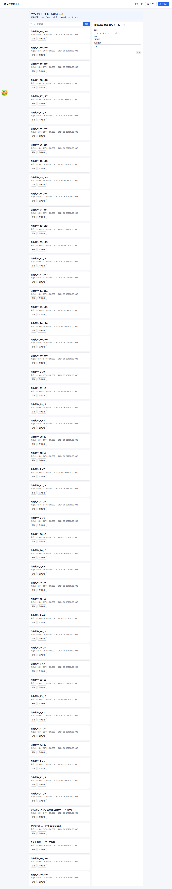
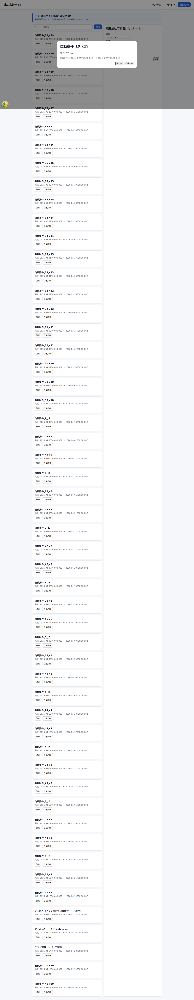
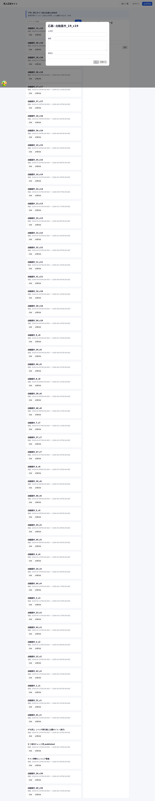
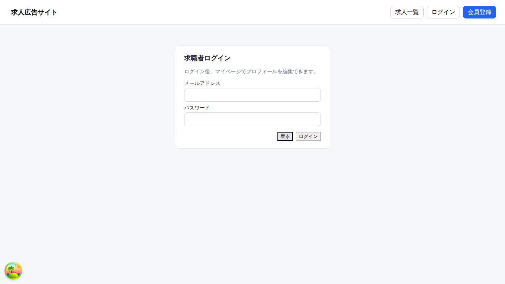
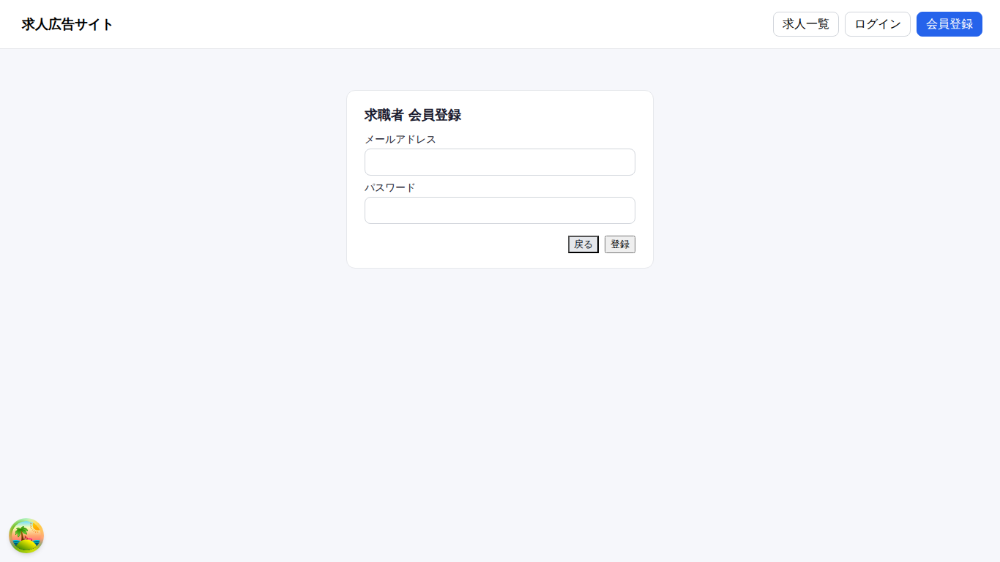
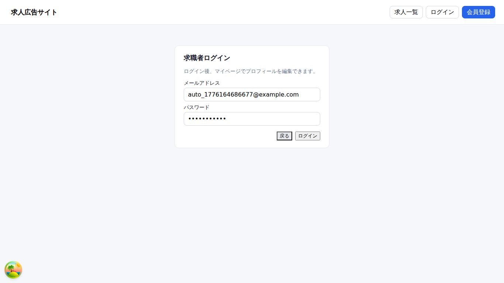

### 5.2 案件管理サイト

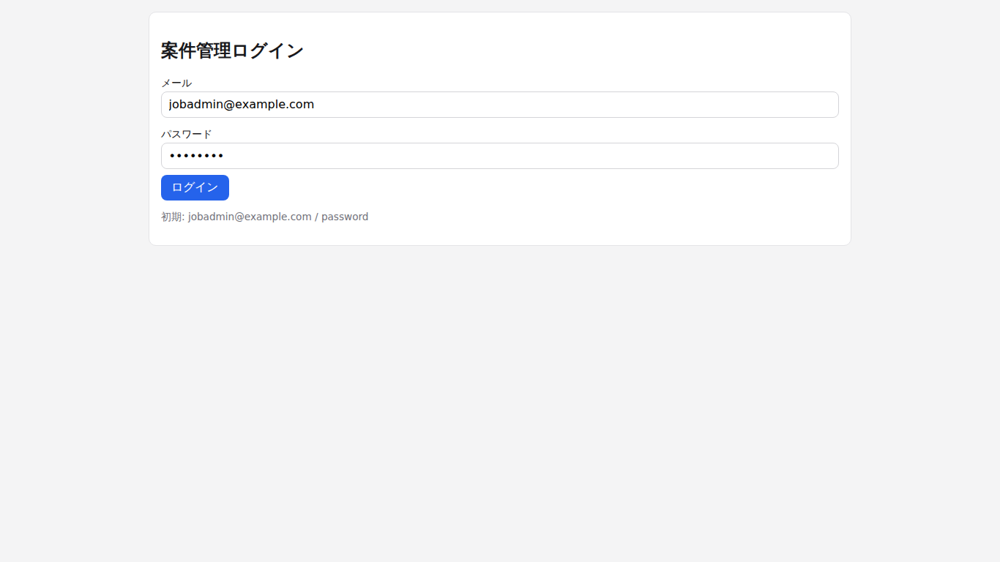

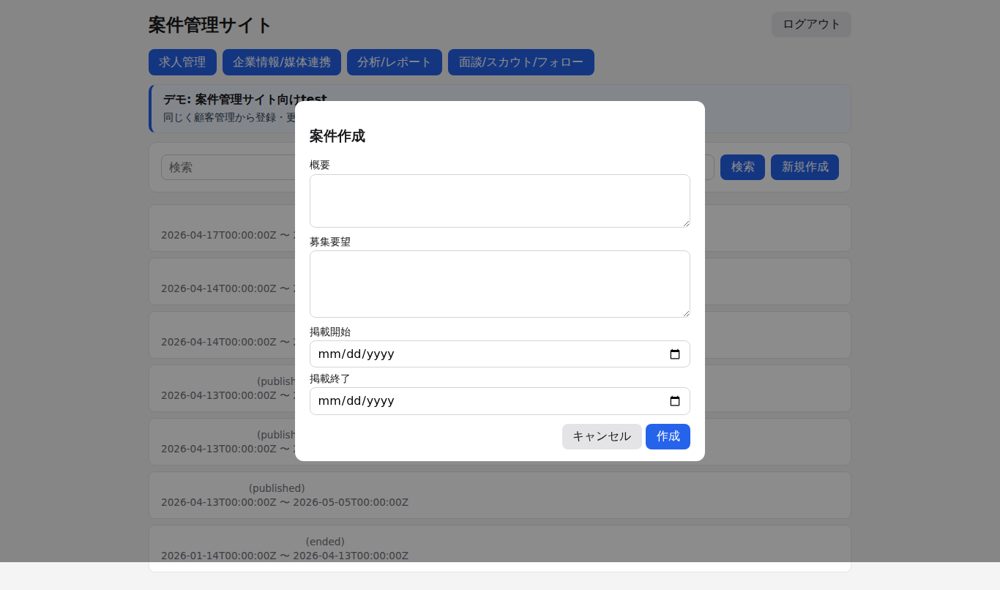
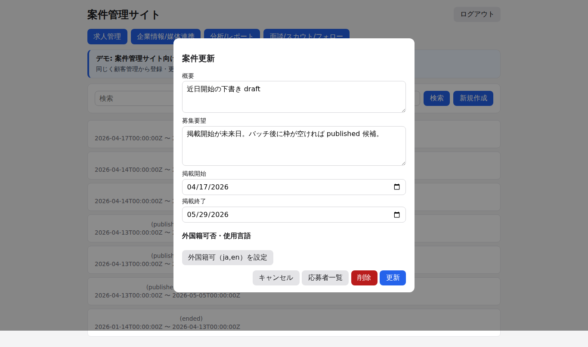
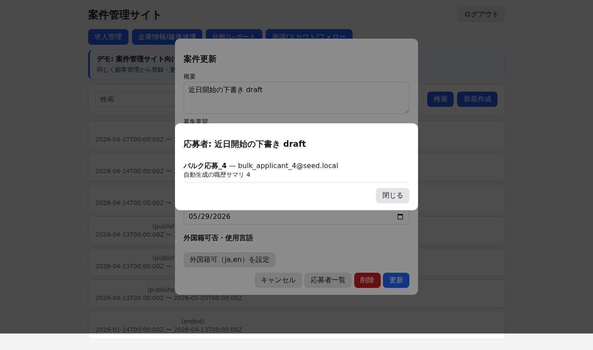
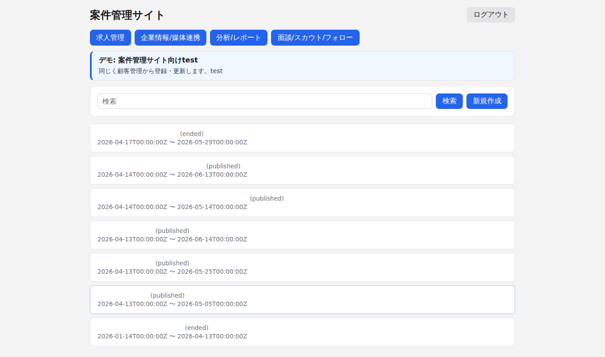

### 5.3 顧客管理サイト

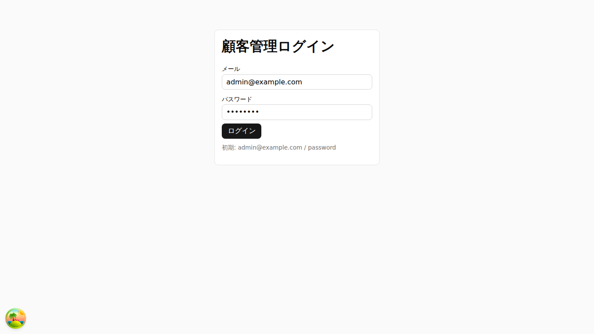

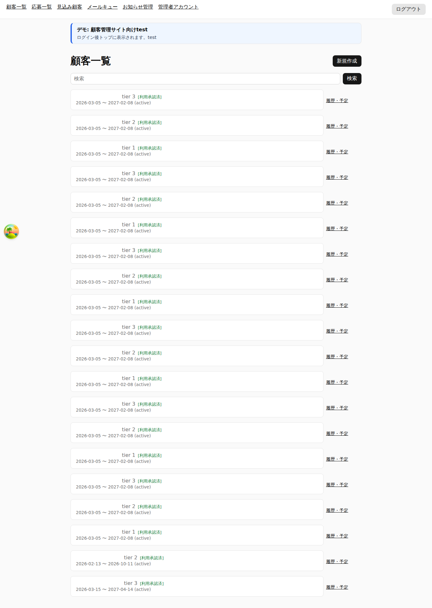
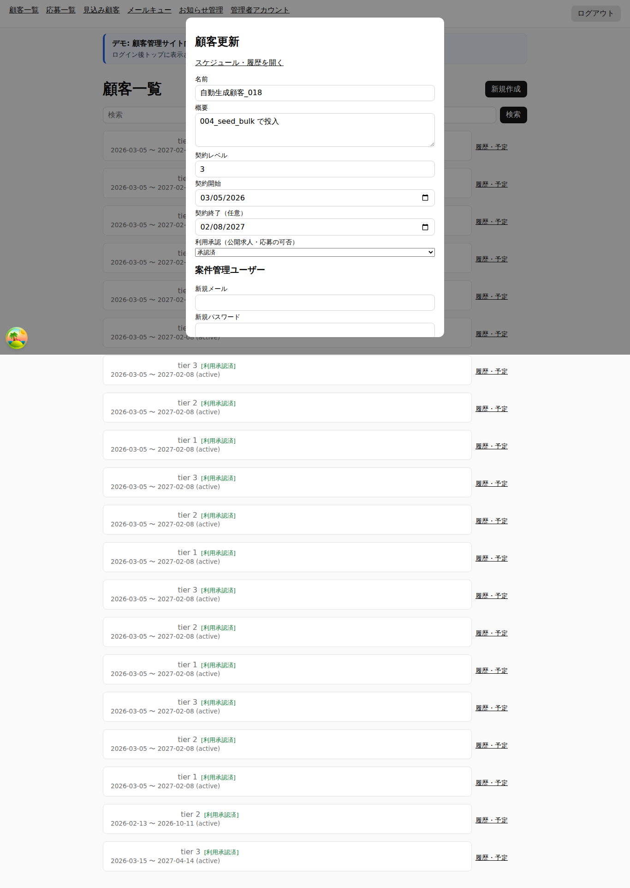
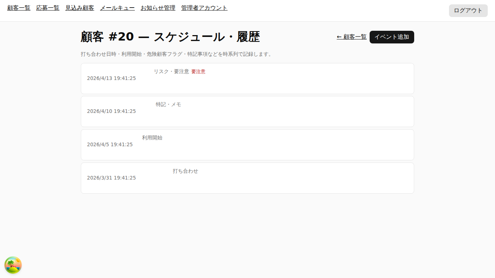

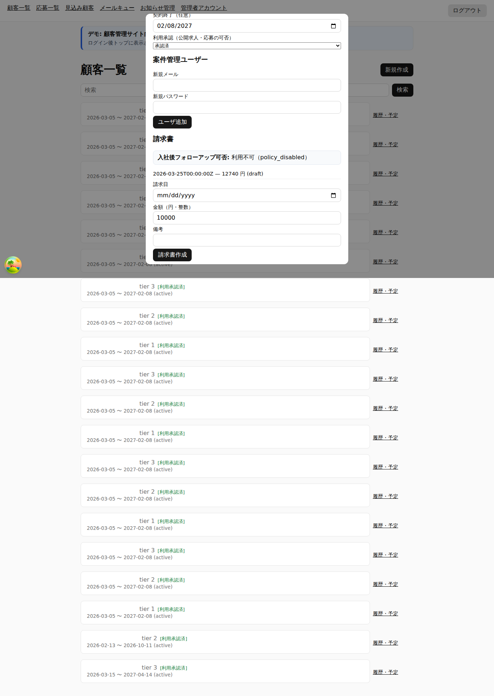
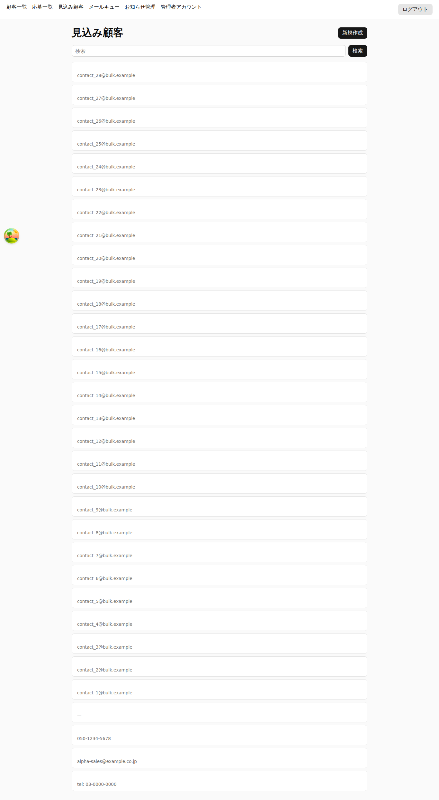
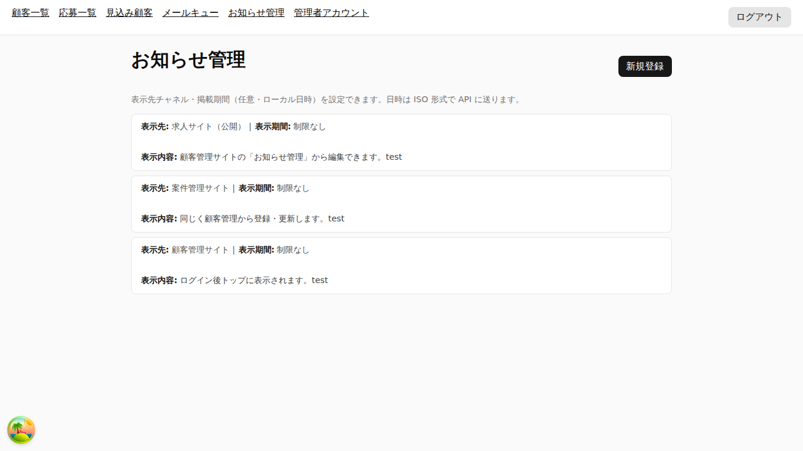
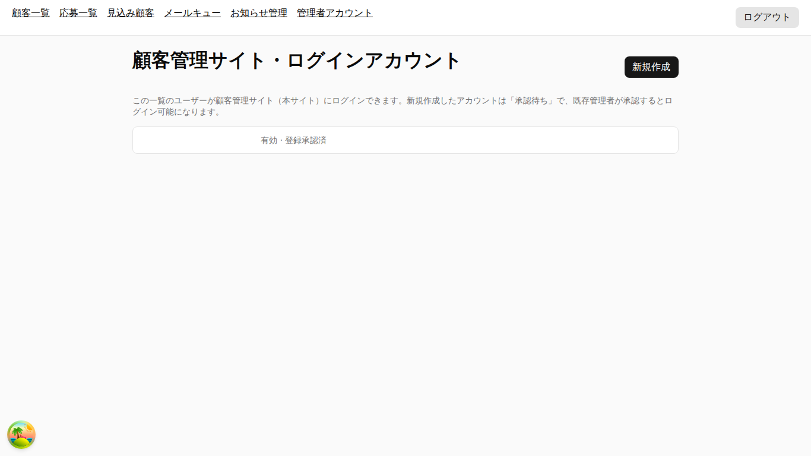
