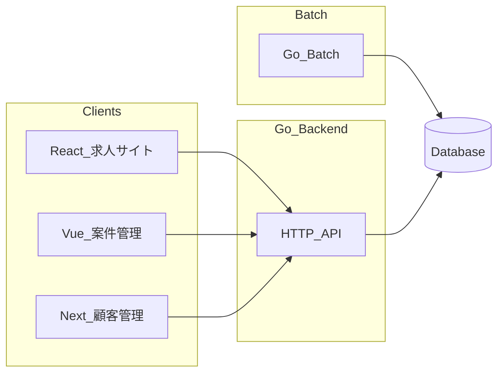

# 求人広告サイト群 実装計画書

## 1. 目的・背景

- 求職者向けの公開求人サイト、広告主向けの案件管理サイト、社内向けの顧客管理サイトを、フロントエンドは用途ごとに分離しつつ、バックエンドとバッチ処理は単一の Go プロジェクトに集約する。
- これにより API の重複を避け、契約レベル・掲載枠・掲載期間といったビジネスルールを一箇所で保守できる。

## 2. システム構成

- **求人サイト（公開）**  
  - フロント: React（独立プロジェクト）  
  - 利用: 案件の閲覧・検索、詳細ポップアップ、応募フォーム

- **案件管理サイト**  
  - フロント: Vue.js（独立プロジェクト）  
  - 利用: ログイン後の案件 CRUD、応募者一覧の確認

- **顧客管理サイト**  
  - フロント: Next.js（独立プロジェクト）  
  - 利用: ログイン後の顧客 CRUD、契約終了、案件管理ユーザー管理、契約レベル、請求書、見込み顧客（営業向け）

- **バックエンド**  
  - 言語: Go（単一リポジトリ／単一モジュールを推奨）  
  - 公開 API と管理系 API を同一プロセスまたは同一バイナリのルートで提供し、ミドルウェアで認証境界を分ける。

- **バッチ**  
  - 言語: Go  
  - 配置: バックエンドと同一リポジトリ内（例: `cmd/batch` または `cmd/publish-job`）。定期実行は OS の cron、Kubernetes CronJob、またはクラウドのスケジューラを想定。

- **API スタイルの推奨**  
  - **REST（JSON）を第一候補とする。** 理由: フロントが React・Vue・Next の三種類あり、ブラウザから呼び出すクライアントが多い。REST はツールチェーンと学習コストが揃いやすく、認証も HTTP ヘッダで統一しやすい。  
  - gRPC はバックエンド間通信向きであり、三つの SPA から直接利用する場合はゲートウェイが別途必要になるため、初期フェーズでは採用優先度を下げる。

## 3. アーキテクチャ概要

## 4. ドメインモデル（論理設計）

- **顧客（Customer）**  
  - 概要、契約期間（開始・終了）、契約レベル（後述の三区分）、契約状態（有効・終了など）

- **契約レベル（ContractTier など）**  
  - 案件掲載無制限  
  - 案件掲載 100 件まで  
  - 案件掲載 10 件まで  

- **案件（JobPosting）**  
  - 顧客への紐付け、概要、募集要望、掲載期間（開始日・終了日）  
  - 掲載ステータス（例: 下書き、掲載中、掲載終了）。要件上は「掲載ステータス」「掲載終了」が明示されているため、管理画面で編集可能な内部状態と、バッチが決める「実際にサイトに出すか」の区別を設計で明確にする（後述）。

- **応募（Application）**  
  - 案件への紐付け、氏名、職歴、連絡先など応募者情報

- **案件管理サイト用ユーザー（JobAdminUser など）**  
  - 顧客に紐付け、ログイン ID・パスワードハッシュ（または IdP 連携用 ID）  
  - 顧客管理サイトからのみ作成・更新・無効化される要件を満たす

- **顧客管理サイト用ユーザー（CustomerAdminUser など）**  
  - 社内オペレータ向け。顧客・請求・見込み顧客を操作する権限

- **請求書（Invoice）**  
  - 顧客への紐付け、発行日、金額、ステータス（下書き・確定など）。明細が必要なら InvoiceLine を別エンティティで持つ。

- **見込み顧客（Prospect / Lead）**  
  - 契約前の見込み。営業向け一覧・詳細画面用。契約済み顧客とテーブル分離するか、同一テーブルで「種別」フラグで分けるかは実装フェーズで決定可（計画段階では「見込み専用の一覧 API」が満たせればよい）。

## 5. 契約レベルと掲載数制約

- **レベル別の上限**  
  - 無制限: 掲載中としてカウントする案件数に上限を設けない（実運用では論理上限やレート制限は別検討）。  
  - 100 件: 同一顧客について「掲載中」扱いの案件は最大 100。  
  - 10 件: 同一顧客について最大 10。

- **「掲載中」としてカウントする条件（バッチ・API で共通化）**  
  - 掲載ステータスが「掲載中」（または同等のフラグ）であること  
  - かつ、当日の日付が掲載期間 `[開始日, 終了日]` に含まれること（境界は仕様確定時に「終了日を含む」等で固定）

- **枠超過時**  
  - 新たに「掲載中」へ昇格させない（要件どおり）。既に掲載中の案件をどうするかは、バッチ節の優先順位で扱う。

## 6. バッチ仕様

- **実行タイミング**  
  - 日次を基本とし、必要なら 1 日複数回（掲載開始日が当日 0 時の運用なら日次で足りることが多い）。

- **処理内容**  
  - 基準日（バッチ実行日の「現在日」、タイムゾーンは JST 等で固定）を取得する。  
  - 全案件（または有効な顧客配下の案件）について掲載期間を評価する。  
  - **期間外**: 掲載終了ステータスへ更新する（既に終了なら no-op）。  
  - **期間内**: 掲載候補とし、顧客の契約レベルに応じた上限を計算する。  
    - その顧客の「掲載中カウント」が上限未満なら、候補案件を掲載中へ更新できる。  
    - 上限に達している場合、**まだ掲載中でない案件**は掲載中に切り替えない。

- **複数候補が同時に枠を超える場合の優先順位（提案）**  
  - 掲載開始日が早い順、同順位なら案件作成日時が早い順、さらに同順位なら案件 ID 昇順など、再現可能なルールを文書化しバッチと単体テストで固定する。

- **契約終了・契約期間外の顧客**  
  - その顧客の案件は新規掲載中にしない。既存掲載中は契約終了時に一括掲載終了とするかは運用ポリシーとして計画書に追記し、実装と合わせる。

## 7. API 設計の骨子（ルートグループ案）

- **`/public`（認証不要、CORS は React オリジンのみ許可など）**  
  - 案件一覧・検索（クエリで検索項目に対応）  
  - 案件詳細（掲載中かつ期間内のもののみ返す）  
  - 応募作成（POST）

- **`/admin/jobs`（案件管理サイト用、JWT 等）**  
  - ログイン、トークン更新（必要なら）  
  - 案件一覧・検索、作成、更新、削除  
  - 案件別応募者一覧

- **`/admin/customers`（顧客管理サイト用、別ロールの JWT 等）**  
  - ログイン  
  - 顧客一覧・検索、作成、更新、契約終了  
  - 案件管理ユーザーの CRUD（顧客スコープ）  
  - 請求書の作成・一覧・詳細（必要範囲）  
  - 見込み顧客一覧・詳細

- **バッチ**  
  - HTTP 経由の「内部ジョブ起動」はセキュリティ上オプション。基本は DB を直接読み書きする CLI バイナリとする。

## 8. 認証・認可

- **案件管理サイト・顧客管理サイト**  
  - ログイン必須。  
  - **推奨: アクセストークン（JWT）＋ HTTPS。** ペイロードにユーザー ID、ロール（`job_admin` / `customer_admin`）、顧客 ID（案件管理ユーザーの場合）を含め、API で検証する。  
  - セッションクッキー＋ Redis 等も可能だが、三フロントから同一ドメインにしない構成では JWT の方が設定が単純になりやすい。

- **権限**  
  - 案件管理ユーザー: 自顧客に紐付く案件・応募のみ。  
  - 顧客管理ユーザー: 全顧客、請求、見込み、案件管理ユーザー管理。

## 9. フロント別・実装順序の提案

- **フェーズ 1**  
  - DB スキーマ、ドメイン層、公開 API（一覧・詳細・応募）  
  - React 求人サイト: トップ兼一覧、詳細ポップアップ、応募ポップアップ

- **フェーズ 2**  
  - 案件管理用認証、案件 CRUD API  
  - Vue 案件管理サイト: ログイン、一覧・検索、作成・更新・削除ポップアップ、応募者一覧ポップアップ

- **フェーズ 3**  
  - Go バッチ: 掲載期間・契約レベルに基づく掲載ステータス更新  
  - 公開 API の「掲載中」フィルタがバッチ結果と一致することを結合テストで確認

- **フェーズ 4**  
  - 顧客管理用認証、顧客・契約レベル・契約終了、案件管理ユーザー CRUD  
  - Next.js 顧客管理サイト: 上記画面

- **フェーズ 5**  
  - 請求書の作成・一覧  
  - 見込み顧客一覧・詳細（営業向け）

- **並行作業**  
  - フェーズ 1 の API 契約（OpenAPI 等）を固めた後、React と Vue の画面実装を分担可能。  
  - バッチはフェーズ 2 の案件データが揃い次第、スタブ DB で先行開発可能。

## 10. 非機能要件（簡潔）

- **データベース**  
  - PostgreSQL を想定（トランザクション、制約、日付クエリに適する）。

- **設定**  
  - 接続文字列、JWT 秘密鍵、実行タイムゾーンは環境変数で注入。

- **ログ**  
  - 構造化ログ（JSON）、リクエスト ID、バッチ実行結果（更新件数サマリ）。

- **ローカル開発**  
  - `docker-compose` で DB のみ、または DB＋API を起動する構成を推奨（必須とはしない）。

## 11. 未決定事項・前提

- インフラ（クラウド事業者、コンテナオーケストレーションの有無）は本仕様に含まれない。  
- メール通知（応募受付、請求書送付）、決済・会計システム連携はスコープ外または後フェーズとする。  
- 履歴書ファイルのアップロード、画像付き求人は要件にないため初期スコープ外とする。  
- 要件の参照元: 同一フォルダの `test` ファイル。

---

**参照**: [test](test)
